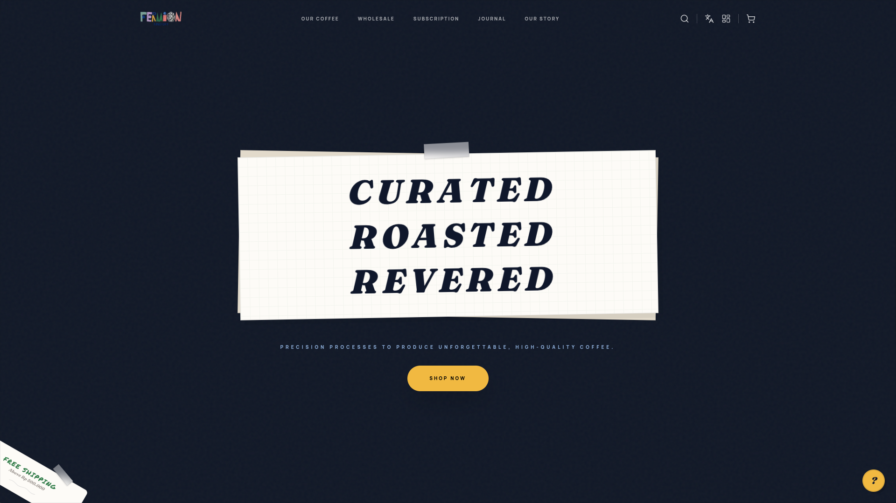
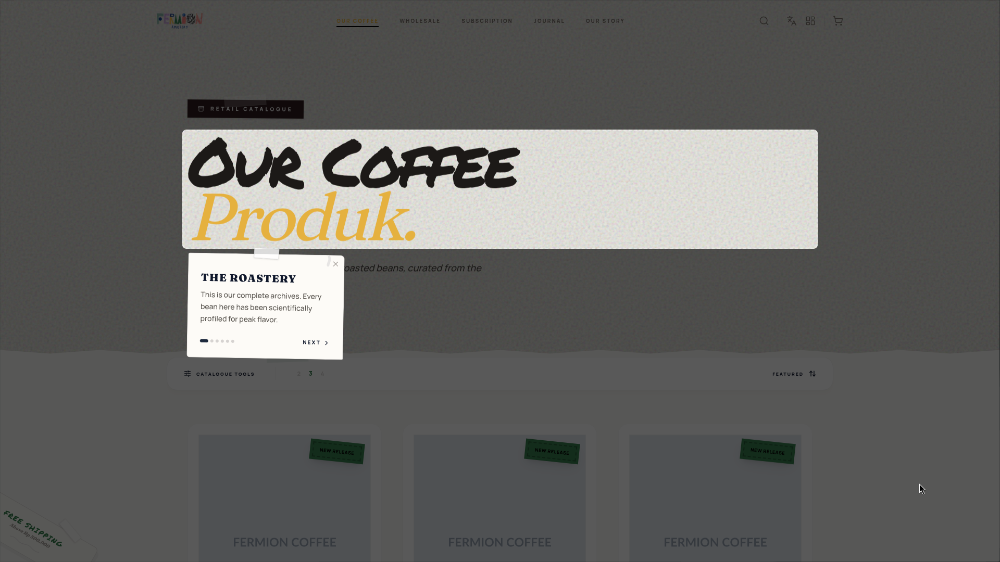
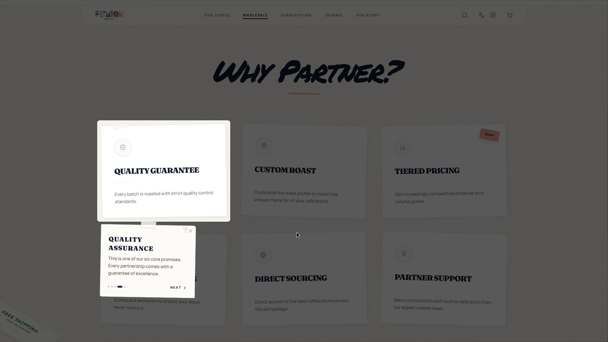

# Fermion Roastery

Welcome to the **Fermion Roastery** project! This is a premium B2B and retail specialty coffee platform engineered to deliver a seamless shopping, subscription, and wholesale management experience.

## 🚀 About the Project

This web application was built entirely as a real-world project for **Fermion Roastery**, serving both everyday coffee lovers and B2B cafe partners. 

**Live Website:** [https://fermionroastery.com](https://fermionroastery.com)

### 📸 Previews

  
  
  

### Key Features
- **Retail E-Commerce:** Dynamic catalog, cart management, and seamless checkout for specialty beans.
- **B2B Partner Portal:** Exclusive dashboard for cafes to manage recurring orders, custom roast profiles, and track invoices.
- **Coffee Subscription:** Automated subscription loop curated by the Head Roaster.
- **Smart Payment Integration:** Automated invoicing and real-time payment webhook integration (Xendit).
- **Admin Dashboard:** Backoffice control for managing inventory, orders, partners, and business intelligence.

---

## 💼 Hire Me

Are you looking for a full-stack engineer to build a robust, beautifully animated, and scalable platform for your business? 

I specialize in:
- High-performance **Next.js** & React architectures
- E-commerce & B2B Dashboard Development
- Modern UI/UX implementation with **GSAP** and **Framer Motion**
- Backend architecture (Node.js/Express) and Database Design (PostgreSQL/Supabase)

If you are interested in discussing your next project or building an application like this for your brand, let's connect!

📫 **Contact Me:**
- Feel free to reach out via [My Portfolio / LinkedIn] *(Replace with actual link)*
- Email me at: *(Replace with email)*

*Note: The codebase inside this repository is proprietary and specifically designed for Fermion Roastery. It is provided here as a portfolio showcase of architecture, logic, and design capabilities. Please do not duplicate this code for your own commercial project. Instead, hire me to build one tailored perfectly for you!*
